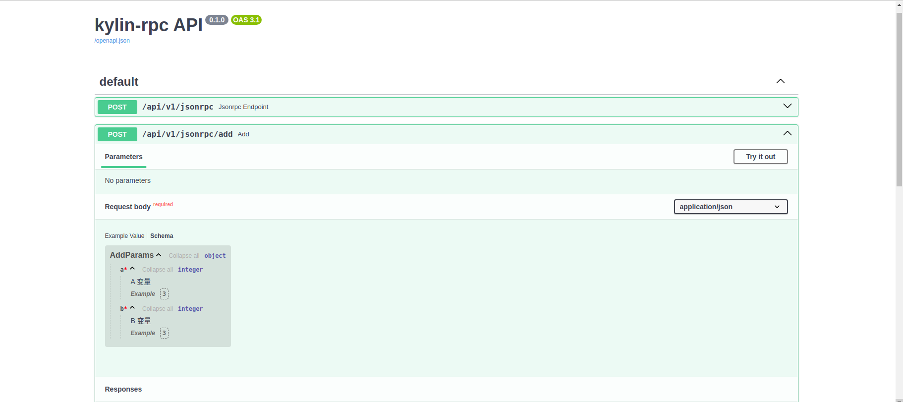
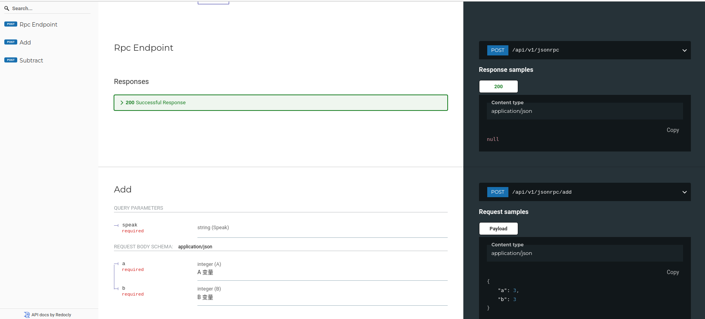

# krpc

`krpc` 是一个用于在 FastAPI 中实现 JSON-RPC（远程过程调用）接口的简单库。它提供了一种方便的方式来定义和处理 JSON-RPC 请求和响应。

## 功能

- 简单易用的 JSON-RPC 接口定义
- 自动参数验证和错误处理
- 兼容 FastAPI 的路由和依赖注入机制
- RpcAPI 自动文档  

## 安装

使用 [Poetry](https://python-poetry.org/) 进行安装：

```sh
poetry add kylin-rpc
```

或者使用 `pip` 进行安装：

```sh
pip install kylin-rpc
```

## 快速开始

### 创建 FastAPI 应用并定义 JSON-RPC 方法

在 `examples/main.py` 中创建一个 FastAPI 应用，并定义一些 JSON-RPC 方法：

```python
from fastapi import FastAPI
from pydantic import BaseModel, Field

from krpc import Entrypoint, JsonRpcException

app = FastAPI(title="krpc API")

# 创建一个 JSON-RPC 入口点
api_v1 = Entrypoint('/api/v1/jsonrpc')


class AddParams(BaseModel):
    a: int = Field(..., example=3, description='A 变量')
    b: int = Field(..., example=3, description='B 变量')


# 定义一个 JSON-RPC 方法 add
@api_v1.method
async def add(params: AddParams) -> int:
    a = params.a
    b = params.b
    if a is None or b is None:
        raise JsonRpcException(code=-32602, message="Invalid params")
    return a + b


# 定义一个 JSON-RPC 方法 subtract
@api_v1.method
async def subtract(params: AddParams) -> int:
    a = params.a
    b = params.b
    if a is None or b is None:
        raise JsonRpcException(code=-32602, message="Invalid params")
    return a - b


# 将 JSON-RPC 入口点注册到 FastAPI 应用中
app.include_router(api_v1)

# 运行应用
if __name__ == "__main__":
    import uvicorn

    uvicorn.run(app, host="0.0.0.0", port=8000)
```

### 运行示例

确保已经安装了依赖，可以运行以下命令来启动服务：

```sh
poetry run uvicorn examples.main:app --reload
```

现在，你可以发送 JSON-RPC 请求到 `http://localhost:8000/api/v1/jsonrpc` 来调用定义的方法。例如：

**Add 方法请求**
```json
{
  "jsonrpc": "2.0",
  "method": "add",
  "params": {"a": 1, "b": 2},
  "id": 1
}
```

**Subtract 方法请求**
```json
{
  "jsonrpc": "2.0",
  "method": "subtract",
  "params": {"a": 5, "b": 3},
  "id": 2
}
```

### 客户端

在 `examples/client.py` 中编写测试代码：

```python
import asyncio

from httpx import AsyncClient


async def main():
    async with AsyncClient() as client:
        response = await client.post("http://127.0.0.1:8000/api/v1/jsonrpc", json={
            "jsonrpc": "2.0",
            "method": "add",
            "params": {"a": 1, "b": 2},
            "id": 1
        })
        response_json = response.json()
        print(f"Response JSON: {response_json}")
        # response = await client.post("http://127.0.0.1:8000/api/v1/jsonrpc", json={
        #     "jsonrpc": "2.0",
        #     "method": "add",
        #     "params": {"a": 1},
        #     "id": 2
        # })
        # response_json = response.text
        # print(f"Response JSON: {response_json}")


asyncio.run(main())

```

运行：

```sh
python examples/client.py
```
## RpcAPI 自动文档

- Swagger UI



- ReDoc



## 许可证

MIT License

版权所有（c）2024 Kylin

特此免费授予任何获得本软件副本及相关文档文件（“软件”）的人，处理软件不受限制，包括但不限于使用、复制、修改、合并、出版、分发、再许可和/或出售软件的副本的权利，以及允许向其提供软件的人员在符合以下条件的情况下这样做：

上述版权声明和本许可声明应包含在软件的所有副本或主要部分中。

本软件按“原样”提供，不提供任何形式的明示或暗示保证，包括但不限于适销性、特定用途适用性和非侵权性。在任何情况下，作者或版权持有人均不对因本软件或本软件的使用或其他交易而产生的任何索赔、损害或其他责任负责，无论是在合同诉讼、侵权诉讼或其他诉讼中。
